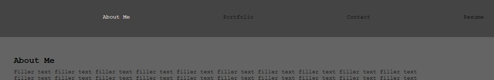
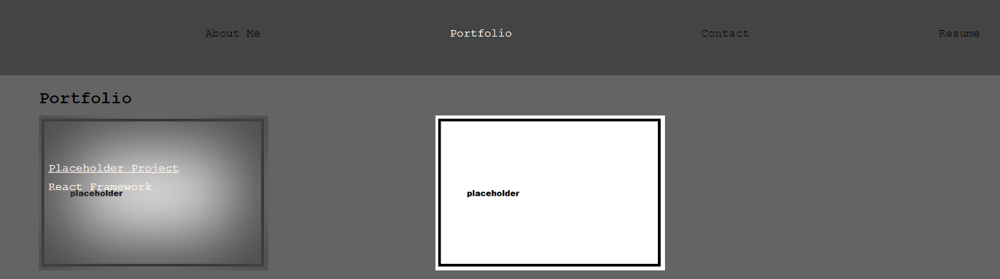
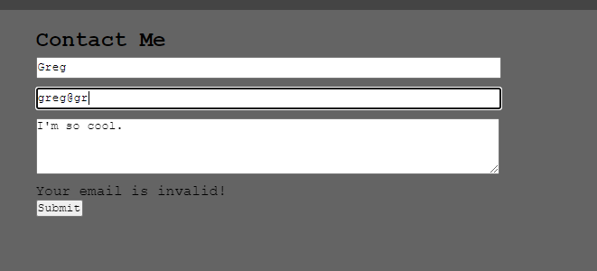

# Week 20: React Portfolio

## Description and Dev Story

For the penultimate (required) challenge for our coding bootcamp, we were tasked with creating the front end of a portfolio website using our newly acquired skills with React. We were to start with no starter code, using only the basic outlines defined in the project readme as a guide.

Coming out the gate from our week of class, I've got to say I'm already in love with React. It's such an intuitive and easy way to easily organize and serve HTML to the user. I can absolutely see myself using it more in future projects and commissions. 

For the notable techniques used, the `About Me` and `Resume` pages were completely static assets, they can just live as `const's` and can be served up usings `states` in the `Header` componant. The `Navigation` componant nested within the Header responds to a number of display states that are set using a number of "hyperlinks". The navigation componant takes in the `displayState` and will return the respective JSX blocks. The `Projects` in the `Portfolio` tab were also created using a mapping of a dummy DB call (seeded as static data in it's own file) as it's own componant.

The other notable technique was for the contact form. Using change states for the username, email and message allowed me to do real time validation for things like verifying a user has entered a regex compliant email address, or had populated the message text area before submission. The form would only submit if all three fields were populated, AND a validation state defaulting to `false` had been set to `true` after passing a number of tests.

## Installation

- App is already deployed to gitHub pages [here.](https://tannerkothlow.github.io/react-portfolio/)

- To download the app on your machine for testing, expansion or reference, clone the repo and run `npm install` in the root folder to download all dependancies.

- To stat the applicaiton, run `npm run start` in the root folder.

## Usage and Features

- To naviagte the app, click on one of the options located in the top bar. Notice how your active tab will be highlighted in white.

- The projects listed in the portfolio have been populated using React Componants, and could easily generate from a database call as well as a static asset included in the app.

- Each card can contain a background images, a title that links to the project, and a breif description of the technology used.

- To view the contact form's included error handlers, expiriment with typing invalid emails and deleting anything you've typed.

- Once your entries for the fields have been validated properly, then you can submit the form.

## License and Credit

Standard MIT license, coursework. This project utilizes [React.](https://reactjs.org/)